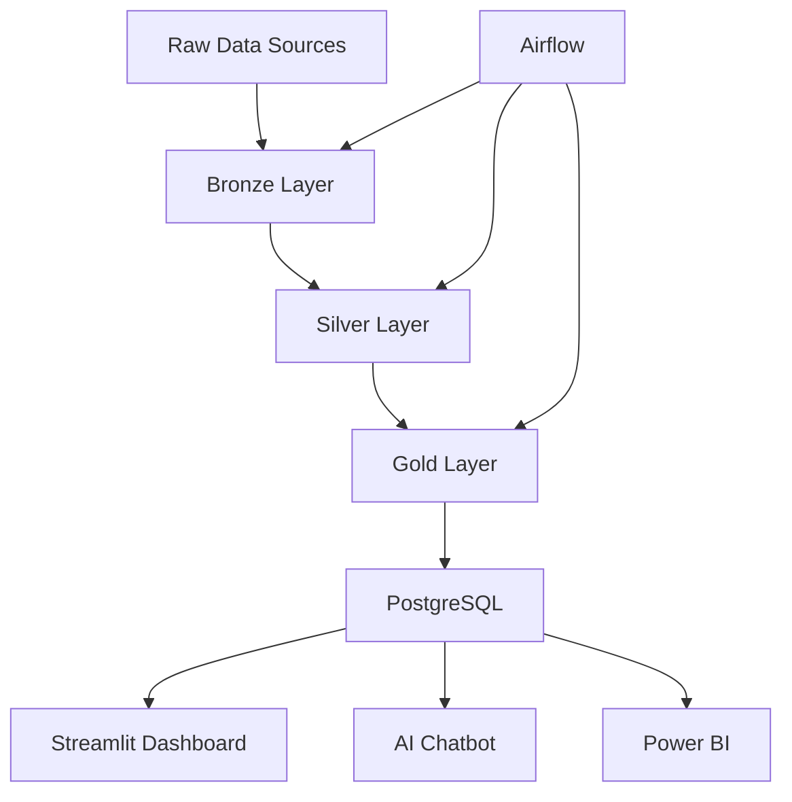

# Healthcare ETL Pipeline & Analytics Platform

## 🏥 Business Problem
Hospitals and healthcare systems need to reduce readmissions, optimize treatment costs, and improve patient outcomes. This project demonstrates how to build a comprehensive ETL pipeline that processes healthcare claims and EHR data to provide actionable insights for healthcare decision-makers.

## 🎯 Solution Overview
A modern data engineering pipeline that:
- **Extracts** raw healthcare data from multiple sources
- **Transforms** and cleans data using industry-standard practices
- **Loads** structured data into a PostgreSQL data warehouse
- **Analyzes** patterns in readmissions, costs, and patient journeys
- **Visualizes** insights through interactive dashboards
- **Enables** natural language queries through AI-powered chatbot

## 🛠️ Tech Stack
- **Data Processing**: Python (pandas, PySpark)
- **Database**: PostgreSQL
- **Orchestration**: Apache Airflow
- **Visualization**: Streamlit, Power BI
- **AI/ML**: LangChain, OpenAI
- **Version Control**: GitHub
- **Cloud**: Docker, AWS (optional)

## 📁 Project Structure
```
healthcare-etl-pipeline/
├── src/                    # Python ETL scripts
│   ├── extract.py         # Data extraction
│   ├── transform.py       # Data transformation
│   ├── load.py           # Data loading
│   └── utils.py          # Utility functions
├── dags/                  # Airflow DAGs
│   └── etl_dag.py        # Main ETL pipeline
├── sql/                   # Database schema & queries
│   ├── schema.sql        # Database schema
│   └── queries.sql       # Analytics queries
├── dashboards/            # Dashboard exports
├── docs/                  # Documentation
│   ├── architecture.md   # System architecture
│   └── presentation.md   # Business presentation
├── notebooks/             # Jupyter notebooks for EDA
├── data/                  # Data storage
│   ├── bronze/           # Raw data
│   ├── silver/           # Cleaned data
│   └── gold/             # Analytics-ready data
├── streamlit_app/         # Streamlit dashboard
├── chatbot/              # AI chatbot implementation
├── requirements.txt      # Python dependencies
├── docker-compose.yml    # Docker setup
└── README.md            # This file
```

## 🚀 Quick Start

### Prerequisites
- Python 3.8+
- PostgreSQL 12+
- Docker (optional)

### Installation
```bash
# Clone the repository
git clone https://github.com/yourusername/healthcare-etl-pipeline.git
cd healthcare-etl-pipeline

# Install dependencies
pip install -r requirements.txt

# Set up environment variables
cp .env.example .env
# Edit .env with your database credentials

# Run the ETL pipeline
python src/extract.py
python src/transform.py
python src/load.py
```

### Using Docker
```bash
# Start the entire stack
docker-compose up -d

# Access the Streamlit dashboard
open http://localhost:8501
```

## 📊 Key Features

### Data Pipeline
- **Bronze Layer**: Raw data ingestion with audit trails
- **Silver Layer**: Cleaned, standardized data
- **Gold Layer**: Business-ready analytics datasets

### Analytics Capabilities
- Cost analysis by diagnosis and provider
- Readmission rate tracking
- Patient journey mapping
- Medication adherence monitoring
- Provider performance metrics

### AI-Powered Insights
- Natural language query interface
- Automated insight generation
- Predictive analytics for readmissions

## 📈 Business Impact
- **Cost Reduction**: Identify high-cost conditions and optimize treatment
- **Quality Improvement**: Track and reduce readmission rates
- **Operational Efficiency**: Streamline data processing and reporting
- **Strategic Decision Making**: Data-driven insights for healthcare leaders

## 🔧 Architecture



## 📋 Sample Queries

### Top Cost Drivers
```sql
SELECT diagnosis_code, SUM(cost) as total_cost
FROM Claims
GROUP BY diagnosis_code
ORDER BY total_cost DESC
LIMIT 10;
```

### Readmission Rates by Hospital
```sql
SELECT hospital_name, 
       AVG(readmission_flag)::numeric(10,2) as readmission_rate
FROM Claims c
JOIN Providers p ON c.provider_id = p.provider_id
GROUP BY hospital_name
ORDER BY readmission_rate DESC;
```

## 🤖 AI Chatbot
Ask natural language questions like:
- "Which diagnosis groups drive 80% of costs?"
- "Show me readmission rates by region"
- "What's the average cost per patient for diabetes?"

## 📊 Dashboard Features
- **KPI Cards**: Key metrics at a glance
- **Cost Analysis**: Breakdown by diagnosis and provider
- **Readmission Tracking**: Trends and patterns
- **Geographic Analysis**: Regional performance
- **Patient Journey**: End-to-end care tracking

## 🎯 Next Steps
1. **Scale**: Migrate to cloud (AWS/Azure)
2. **Real-time**: Implement streaming data processing
3. **ML Models**: Add predictive analytics
4. **Integration**: Connect to EHR systems
5. **Compliance**: Add HIPAA security measures

## 📞 Contact
For questions or collaboration opportunities, please reach out through GitHub issues or LinkedIn.

## 📄 License
This project is licensed under the MIT License - see the LICENSE file for details.

---
*Built with ❤️ for healthcare data professionals*
