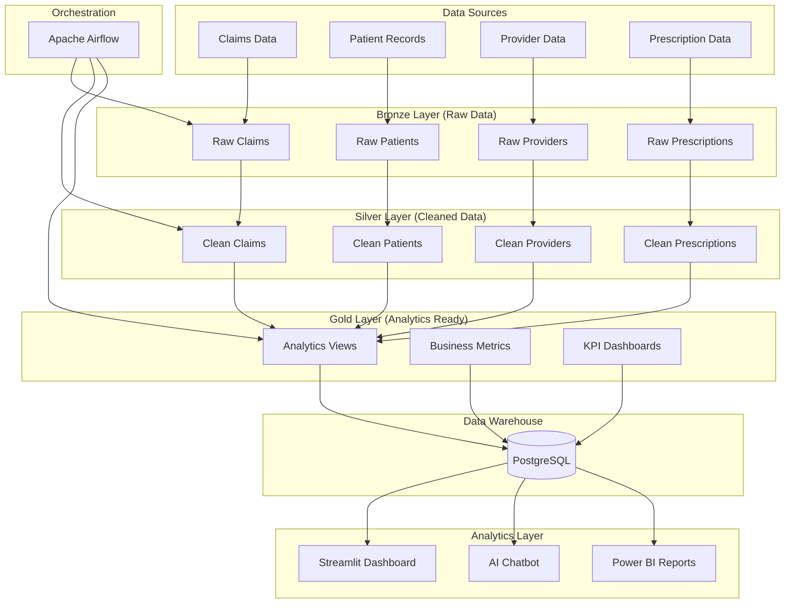

# Healthcare ETL Pipeline Architecture

## System Overview

The Healthcare ETL Pipeline is a comprehensive data processing system designed to extract, transform, and load healthcare data for analytics and business intelligence. The system follows modern data engineering best practices with a layered architecture.

## Architecture Diagram

## Data Flow

### 1. Data Ingestion (Bronze Layer)
- **Purpose**: Store raw data as-is from source systems
- **Format**: Parquet files for efficient storage and processing
- **Location**: `./data/bronze/`
- **Features**:
  - Data lineage tracking
  - Audit trails
  - Raw data preservation

### 2. Data Transformation (Silver Layer)
- **Purpose**: Clean, standardize, and enrich data
- **Processes**:
  - Data validation and quality checks
  - Standardization of formats (dates, codes, etc.)
  - Feature engineering
  - Data deduplication
- **Location**: `./data/silver/`
- **Features**:
  - Data quality metrics
  - Transformation logs
  - Error handling and reporting

### 3. Data Loading (Gold Layer)
- **Purpose**: Load processed data into analytics database
- **Database**: PostgreSQL with healthcare schema
- **Features**:
  - Referential integrity
  - Indexing for performance
  - Business views and metrics
  - Data governance

## Technology Stack

### Data Processing
- **Python 3.8+**: Core programming language
- **Pandas**: Data manipulation and analysis
- **PySpark**: Large-scale data processing (optional)
- **SQLAlchemy**: Database ORM and connection management

### Database
- **PostgreSQL 12+**: Primary data warehouse
- **Schema**: Normalized healthcare data model
- **Indexing**: Optimized for analytics queries
- **Views**: Pre-computed business metrics

### Orchestration
- **Apache Airflow**: Workflow orchestration
- **DAGs**: Directed Acyclic Graphs for pipeline management
- **Scheduling**: Daily automated runs
- **Monitoring**: Task success/failure tracking

### Visualization & Analytics
- **Streamlit**: Interactive web dashboard
- **Plotly**: Interactive charts and graphs
- **LangChain**: AI-powered natural language queries
- **OpenAI GPT**: Language model for chatbot

### Infrastructure
- **Docker**: Containerization (optional)
- **Git**: Version control
- **GitHub**: Code repository and collaboration

## Data Models

### Core Entities

#### Patients
- Demographics and clinical information
- Risk stratification
- Chronic condition tracking
- Patient journey mapping

#### Providers
- Hospital and facility information
- Performance metrics
- Geographic distribution
- Capacity and utilization

#### Claims
- Healthcare billing and utilization
- Cost analysis
- Readmission tracking
- Procedure and diagnosis codes

#### Prescriptions
- Medication management
- Adherence tracking
- Cost analysis
- Provider prescribing patterns

### Relationships
- **One-to-Many**: Patients → Claims, Patients → Prescriptions
- **One-to-Many**: Providers → Claims, Providers → Prescriptions
- **Many-to-One**: Claims → Diagnosis Codes, Prescriptions → Medications

## Security & Compliance

### Data Privacy
- **HIPAA Considerations**: Healthcare data protection
- **Data Anonymization**: Patient privacy preservation
- **Access Controls**: Role-based permissions
- **Audit Logging**: Data access tracking

### Data Quality
- **Validation Rules**: Business rule enforcement
- **Data Profiling**: Quality metrics tracking
- **Error Handling**: Graceful failure management
- **Monitoring**: Real-time quality alerts

## Performance Optimization

### Database Optimization
- **Indexing Strategy**: Optimized for analytics queries
- **Partitioning**: Time-based data partitioning
- **Query Optimization**: Efficient SQL patterns
- **Connection Pooling**: Resource management

### Data Processing
- **Chunking**: Large dataset processing
- **Parallel Processing**: Multi-threaded operations
- **Caching**: Frequently accessed data
- **Compression**: Storage optimization

## Monitoring & Alerting

### Pipeline Monitoring
- **Task Success/Failure**: Airflow task monitoring
- **Data Quality Metrics**: Automated quality checks
- **Performance Metrics**: Processing time tracking
- **Error Logging**: Comprehensive error tracking

### Business Monitoring
- **KPI Tracking**: Key performance indicators
- **Anomaly Detection**: Unusual pattern identification
- **Trend Analysis**: Historical data analysis
- **Alerting**: Automated notifications

## Scalability Considerations

### Horizontal Scaling
- **Microservices**: Modular architecture
- **Container Orchestration**: Kubernetes deployment
- **Load Balancing**: Distributed processing
- **Data Partitioning**: Sharded data storage

### Vertical Scaling
- **Resource Optimization**: CPU and memory tuning
- **Database Scaling**: Read replicas and clustering
- **Caching Layers**: Redis or Memcached
- **CDN**: Content delivery optimization

## Disaster Recovery

### Backup Strategy
- **Database Backups**: Regular automated backups
- **Data Replication**: Cross-region replication
- **Version Control**: Code and configuration backup
- **Documentation**: Recovery procedures

### High Availability
- **Redundancy**: Multiple instance deployment
- **Failover**: Automatic failover mechanisms
- **Health Checks**: Continuous system monitoring
- **Recovery Testing**: Regular disaster recovery drills

## Future Enhancements

### Advanced Analytics
- **Machine Learning**: Predictive analytics
- **Real-time Processing**: Stream processing
- **Advanced Visualizations**: 3D charts and maps
- **Mobile Applications**: Mobile dashboard access

### Integration
- **API Development**: RESTful API endpoints
- **Third-party Integrations**: EHR system connections
- **Cloud Migration**: AWS/Azure deployment
- **Data Lake**: Big data storage solution

## Maintenance & Operations

### Regular Maintenance
- **Data Archiving**: Historical data management
- **Performance Tuning**: Query optimization
- **Security Updates**: Regular security patches
- **Documentation Updates**: Keeping docs current

### Operational Procedures
- **Deployment Process**: CI/CD pipeline
- **Monitoring Setup**: Alert configuration
- **Backup Verification**: Regular backup testing
- **Capacity Planning**: Resource forecasting
